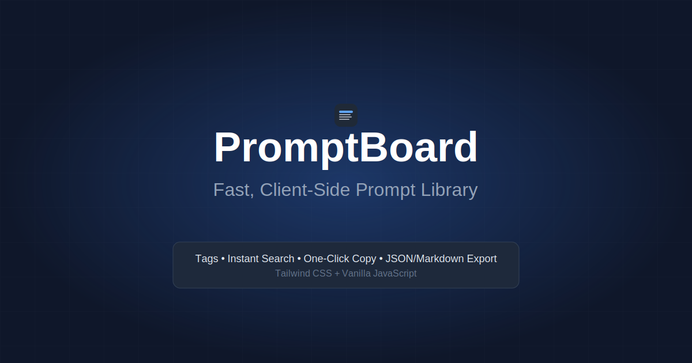

# PromptBoard



A fast, client-side prompt library with tags, instant search, one-click copy, and JSON/Markdown export. Tailwind + vanilla JS.

## 🚀 MVP Features

- **✅ CRUD Operations**: Create, read, update, delete prompts with LocalStorage persistence
- **✅ Variable Placeholders**: Use `{{name}}` and `{{name|default}}` syntax with Insert & Copy
- **✅ Auto-Backup**: Configurable automatic backups with local ring buffer storage
- **✅ Instant Search**: Lightning-fast prompt filtering with 150ms debounce
- **✅ Multi-Tag Filters**: Filter by multiple tags with AND logic
- **✅ One-Click Copy**: Copy prompt content to clipboard with toast feedback
- **✅ Duplicate Prompts**: Duplicate existing prompts with one click
- **✅ Export/Import**: JSON and Markdown export with merge/replace import options
- **✅ URL State**: Search query and tag filters persist in URL
- **✅ Keyboard Shortcuts**: `/` to search, `n` for new prompt, `b` for settings
- **✅ Accessibility**: Full ARIA support, focus management, screen reader friendly
- **✅ Client-Side**: No backend required, works entirely in the browser
- **✅ Dark Mode**: Beautiful dark interface by default
- **✅ Responsive**: Works seamlessly on desktop and mobile

## ⌨️ Keyboard Shortcuts

- **`/`** - Focus search input
- **`n`** - Create new prompt  
- **`b`** - Open settings panel
- **`Escape`** - Clear search and filters, or close modal
- **`Ctrl/Cmd + Enter`** - Save prompt in modal
- **`Enter`** - Confirm in placeholder modal
- **`Escape`** - Close placeholder modal

## 🛠 Tech Stack

- **Frontend**: Vanilla JavaScript (ES6+ modules)
- **Styling**: Tailwind CSS (CDN)
- **Storage**: Local Storage API with migration support
- **Build**: No build process required
- **Deploy**: Vercel-ready static site

## 🏃‍♂️ Running Locally

1. **Clone the repository**
   ```bash
   git clone https://github.com/G-Reg04/promptboard-greg.git
   cd promptboard-greg
   ```

2. **Open in browser**
   ```bash
   # Using Python
   python -m http.server 8000
   
   # Using Node.js
   npx serve .
   
   # Or simply open index.html in your browser
   ```

3. **Visit** `http://localhost:8000`

## 🚀 Deploy to Vercel

[](https://vercel.com/new/clone?repository-url=https://github.com/G-Reg04/promptboard-greg)

Or manually:

1. **Install Vercel CLI**
   ```bash
   npm i -g vercel
   ```

2. **Deploy**
   ```bash
   vercel
   ```

## 📁 Project Structure

```
promptboard-greg/
├── index.html          # Main HTML file (loads app.js as ES module)
├── app.js              # Main application orchestrator
├── js/                 # ES6 modules
│   ├── storage.js      # LocalStorage operations, state management, UUID
│   ├── utils.js        # Utilities (debounce, sanitize, focusTrap, downloadFile)  
│   ├── render.js       # UI rendering (app, cards, filters, toasts, modals)
│   ├── logic.js        # CRUD operations, search, filtering, clipboard
│   └── io.js           # Import/export functionality (JSON, Markdown)
├── assets/
│   ├── icon.svg        # App favicon
│   └── readme-banner.svg # README banner
├── vercel.json         # Vercel configuration
├── .gitignore          # Git ignore rules
└── README.md           # This file
```

## 💾 Data Schema

LocalStorage key: `promptboard:v1`

```json
{
  "version": 1,
  "prompts": [
    {
      "id": "uuid-v4",
      "title": "Prompt Title",
      "content": "Prompt content...",
      "tags": ["tag1", "tag2", "tag3"],
      "createdAt": 1690000000000,
      "updatedAt": 1690000000000
    }
  ]
}
```

## 🔀 Placeholders & Insert & Copy

### Variable Syntax

Use placeholders in your prompt content with the following syntax:

- **`{{name}}`** - Simple placeholder that must be filled
- **`{{name|default}}`** - Placeholder with default value

### Auto-Values

Special placeholders that are automatically filled:

- **`{{today}}`** - Current date (YYYY-MM-DD format)
- **`{{now}}`** - Current date and time (YYYY-MM-DD HH:mm format)

### Usage Examples

```
Hello {{name}},

Today is {{today}} and I'm writing to discuss {{topic|the project}}.

Please review the document by {{deadline}}.

Best regards,
{{signature|Your Name}}
```

### Insert & Copy Flow

1. **Detect Variables**: Prompts with placeholders show a purple "Insert & Copy" button
2. **Fill Variables**: Click the button to open a modal with input fields for each placeholder
3. **Auto-Complete**: Previously used values for each prompt are remembered and pre-filled
4. **Copy Result**: Processed text is automatically copied to clipboard

### Cache Behavior

- Variable values are cached per prompt in localStorage
- Auto-values (`today`, `now`) are always current and not cached
- Cache persists across browser sessions

## 🔄 Auto-Backup System

### Configuration

Access via Settings panel (`b` key or ⚙️ button):

- **Enable/Disable**: Toggle automatic backup on/off (default: ON)
- **Threshold**: Set number of changes before backup triggers (default: 10)
- **Counter**: View current changes count

### Backup Types

1. **Auto-Download**: Automatic file download when threshold is reached
2. **Local Ring Buffer**: Keep last 3 backups in browser storage

### Local Backups

- **Max Storage**: 3 most recent backups
- **Actions**: Download as JSON file or restore (merge/replace)
- **Metadata**: Shows backup date and prompt count

### Change Tracking

Changes counted:
- Create new prompt
- Update existing prompt  
- Delete prompt
- Import prompts

## 📤 Export/Import

### Export Formats

- **JSON**: Full data export with metadata for re-importing
- **Markdown**: Human-readable format with sections for each prompt

### Import Options

- **Merge**: Add new prompts, skip duplicates (based on title+content hash)
- **Replace**: Replace all existing prompts with imported data

### Validation

- Title is required (max 200 chars)
- Content is optional (max 50,000 chars)  
- Tags are optional (max 20 tags, 50 chars each)
- Invalid items are skipped with detailed error reporting


## 📝 License

MIT License - see [LICENSE](LICENSE) file for details.

## 🤝 Contributing

1. Fork the repository
2. Create your feature branch (`git checkout -b feature/amazing-feature`)
3. Commit your changes (`git commit -m 'Add some amazing feature'`)
4. Push to the branch (`git push origin feature/amazing-feature`)
5. Open a Pull Request

---

**PromptBoard** - Organize your prompts, supercharge your workflow! ⚡
